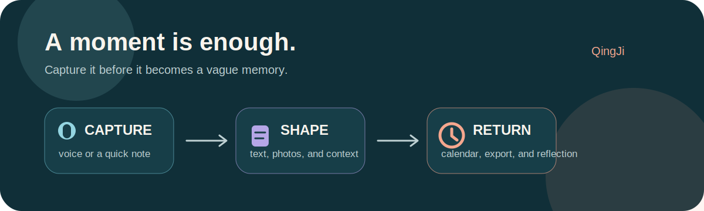

<p align="center">
  
</p>

<h1 align="center">瞬记 · QingJi</h1>

<p align="center">
  <strong>把来不及整理的那一刻，先留下来。</strong><br />
  <em>Keep the moment before it asks you to explain it.</em>
</p>

<p align="center">
  <a href="https://github.com/yinbaozong/qingji-android/actions/workflows/android.yml"></a>
  <a href="LICENSE"></a>
  
  
</p>

---

有些梦在刷牙的时候就散了。白天也一样：电梯里忽然冒出的想法、散步时的一阵轻松、会议后还没来得及写下的决定，常常在你有空打开备忘录之前，已经被下一件事挤走。

瞬记不是要求你每天写一篇完美日记。它想做的是更小的一件事：当你只有十秒钟，也能按住按钮说一句话；当你不方便说话，也能点一下 `+` 先写个开头。整理可以晚一点，留下来要趁现在。

Some dreams disappear while you are brushing your teeth. Daytime moments do the same: a thought in an elevator, the feeling after a walk, or a decision that was clear right after a meeting. QingJi is not here to make you write a perfect daily journal. It gives you a small, low-friction place to catch the moment first, then return to it when you have time.

<p align="center">
  
</p>

## 为什么是瞬记？ / Why QingJi?

**记录习惯最容易输给“等我有空再写”。** 瞬记把入口放在首页底部：白天、夜间、文字，三种方式都只需要一次点击。语音会保存到本地，转写完成后可以继续改；照片、待办、天气和位置也能自然地长在同一条记录里。

**The hardest part of journaling is usually the first few seconds.** QingJi keeps three capture paths within reach: daytime voice, nighttime voice, and a quick text note. You can speak first and edit later, keep photos in the body of an entry, and revisit a day through a calendar instead of a pile of files.

## 它能做什么 / What it does

| 中文 | English |
| --- | --- |
| **白天与夜间双入口**：把日常片段和梦分开记录，但仍在同一条时间线里回看。 | **Day and night capture**: keep ordinary moments and dreams distinct without splitting your history. |
| **一键录音与波形反馈**：长按开始，实时看到音量和录制时长。 | **Voice capture with live feedback**: see the waveform and elapsed time while recording. |
| **语音转文字，可继续编辑**：支持系统识别、百度与阿里云 ASR，并为可替换 Provider 留好接口。 | **Editable transcription**: system speech, Baidu, and Aliyun ASR are supported through replaceable providers. |
| **文字、照片、待办写在一起**：图片插入正文，可选小图、中图、满宽；待办可以勾选完成。 | **Text, photos, and to-dos in one entry**: photos live between paragraphs and support three display widths. |
| **天气与位置上下文**：创建记录时自动保存简短天气，并在授权后尽量保存城市和区县。 | **Weather and place context**: save a compact weather label and, with permission, a city and district. |
| **日历回看**：有记录的日期带标记，左右滑动翻月，按年跳转。 | **Calendar recall**: marked dates, swipeable months, and year jumping make old moments easy to find. |
| **AI 分析与对话**：可接入 DeepSeek、MiniMax、通义千问、智谱 GLM 或自定义兼容服务，对一条记录继续追问。 | **AI reflection and chat**: connect DeepSeek, MiniMax, Qwen, Zhipu GLM, or a custom OpenAI-compatible service. |
| **可带走的导出**：导出 TXT、Markdown 或包含图片和录音的 ZIP，并直接调用系统分享。 | **Portable exports**: export TXT, Markdown, or a media ZIP, then share it with the Android system sheet. |

## 从一句话开始 / From one sentence

```text
按住“白天”或“夜间”
        ↓
先说下来，或点中间的 + 直接写
        ↓
录音留在本地，转写进入可编辑正文
        ↓
需要时补照片、待办、标签和想法
        ↓
在日历里回看，或导出给未来的自己
```

这也是瞬记最重要的原则：**捕捉优先于整理。**

That is QingJi's central idea: **capture before you organize.**

## 截图与视觉 / Visual language

瞬记使用一套安静的雾面玻璃界面：状态栏、正文和底部导航连成同一片背景，半透明表面只用来托住正在操作的内容。亮色像晨雾，暗色更接近墨色玻璃，不再用突兀的系统色切断页面。

QingJi uses a restrained frosted-glass system. The status bar, workspace, and bottom navigation share one continuous backdrop, while translucent surfaces appear only where they help you act or read.

<p align="center">
  
</p>

## 隐私与数据 / Privacy and data

- 记录、录音、照片和导出文件默认保存在设备本地。 / Entries, audio, photos, and exports stay on the device by default.
- 只有在你主动配置并使用语音或 AI Provider 时，相关内容才会发送到对应服务。 / Content reaches a speech or AI provider only after you choose and configure one.
- API Key 不写入代码仓库；请只在 App 的“我的 > 服务配置”中填写自己的 Key。 / API keys are never committed to this repository. Enter your own key in the app settings.
- 导出文件可以在“我的 > 数据导出 > 清理”中删除，不会影响原始记录。 / Generated exports can be removed from `Mine > Export > Clean` without touching original entries.

## 开始使用 / Getting started

### 直接安装 / Install the APK

前往 [Releases](https://github.com/yinbaozong/qingji-android/releases/latest) 下载最新 APK。Android 可能会要求允许“安装未知应用”，这是从 GitHub 安装的正常系统提示。

Download the latest APK from [Releases](https://github.com/yinbaozong/qingji-android/releases/latest). Android may ask you to allow installs from your browser or file manager.

### 在 Android Studio 运行 / Run from Android Studio

```bash
git clone https://github.com/yinbaozong/qingji-android.git
cd qingji-android
```

1. 使用 Android Studio 打开项目根目录。 / Open the project root in Android Studio.
2. 选择 JDK 17。 / Select JDK 17 for Gradle.
3. 等待 Gradle Sync 完成。 / Wait for Gradle Sync.
4. 选择模拟器或手机后运行 `app`。 / Choose an emulator or device, then run `app`.

也可以直接构建 Debug APK：

```powershell
.\gradlew.bat assembleDebug
```

输出路径：`app/build/outputs/apk/debug/app-debug.apk`

## 可选服务配置 / Optional service configuration

瞬记可以离线保存和手动编辑，不配置任何 Key 也能使用基础记录功能。

若想使用转写或 AI 分析，请在 App 的“我的 > 服务配置”中选择厂商并填写自己的 Key。常用厂商会自动带出地址和推荐模型，高级参数只在“自定义服务”中出现：

- Speech to text: 阿里云 Qwen ASR（推荐）、系统识别、百度短语音或 OpenAI-compatible Provider
- AI analysis: DeepSeek、MiniMax、通义千问、智谱 GLM 或 OpenAI-compatible Provider

每个 AI 厂商的 Key 单独保存在本机。你可以从 DeepSeek 切到千问，再切回来，原来的 Key 不会被覆盖。升级自旧版本时，已有的 MiniMax / 千问配置会自动迁移。

Each AI provider keeps its own local key slot. Switching providers no longer overwrites a previous credential, and existing MiniMax or Qwen settings migrate automatically from older builds.

官方接口参考 / Official API references: [DeepSeek](https://api-docs.deepseek.com/) · [MiniMax](https://platform.minimaxi.com/docs/api-reference/api-overview) · [通义千问](https://help.aliyun.com/zh/model-studio/base-url) · [智谱 GLM](https://docs.bigmodel.cn/cn/guide/develop/openai/introduction) · [Qwen ASR](https://help.aliyun.com/zh/model-studio/qwen-asr-api-reference)

The app remains useful without any key. Configure a provider only when you want transcription or AI reflection.

## 技术栈 / Built with

- Kotlin + Jetpack Compose
- Room for local persistence and safe schema migrations
- DataStore for settings
- Local audio and photo storage
- Provider interfaces for speech-to-text and AI analysis
- Android system sharing for TXT, Markdown, and ZIP exports

## 开发状态 / Project status

当前版本是一个可运行的本地优先 MVP。它已经覆盖“快速留下、回来整理、带走数据”这条完整路径；同步、多设备备份和更丰富的编辑能力仍然值得慢慢打磨。

QingJi is a working, local-first MVP. The core loop is already here: capture quickly, return to edit, and take your data with you. Sync, backup, and deeper editing are future work.

如果这个项目帮你留下了一个原本会消失的梦，或者一段普通但后来变重要的日常，欢迎点一个 Star。它会提醒我，这个小工具确实在别人的生活里有了一点位置。

If QingJi helps you keep one dream or one ordinary moment that would otherwise disappear, a Star is a lovely way to let the project know it found a place in someone's life.

## v1.4.0

- 重做全局雾面玻璃视觉，并让 Android 状态栏与页面背景统一。
- AI 服务改为厂商选择器，新增 DeepSeek、智谱 GLM 和自定义 OpenAI-compatible 服务。
- 不同 AI 厂商分别保存 API Key，兼容迁移旧版配置。
- 语音配置默认突出阿里云，仅在需要时展示百度或高级兼容参数。
- 记录详情支持直接输入新标签，添加后立即选中并成为常用标签。

Version 1.4.0 introduces the continuous frosted-glass UI, a compact provider picker for DeepSeek, MiniMax, Qwen, Zhipu GLM, and custom endpoints, per-provider credential storage, a simpler speech setup, and inline custom tag creation.

## License

[MIT](LICENSE) © 2026 Yinbaozong
