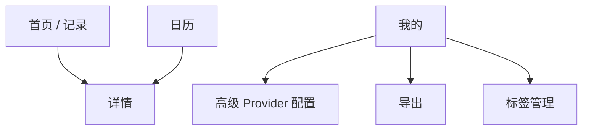

# Navigation And User Flow

## Navigation Map

Current routes:

- `home`
- `calendar`
- `settings`
- `detail/{entryId}`

## Primary Flow: Record

1. User opens Home.
2. User taps Day or Night.
3. App checks recording permission or system speech mode.
4. Recording starts with elapsed time and audio level.
5. User stops recording.
6. App saves audio locally.
7. App creates record.
8. App attempts transcription when provider supports it.
9. App opens Detail.
10. User edits title/body/tags/photos/todos.

## Secondary Flow: Manual Transcription

1. User opens Detail.
2. User taps `转文字`.
3. App calls selected speech provider.
4. On success, transcript is attached and body is filled if empty.
5. On failure, record and audio remain available.

## AI Flow

1. User configures AI provider in Mine.
2. User optionally edits first-analysis prompt.
3. User opens Detail and taps `AI 分析`.
4. App sends record body plus prompt context.
5. Result is stored in record analysis fields.
6. User can continue chat in the Detail conversation section.

## Calendar Flow

1. User opens Calendar.
2. Month grid is visible immediately.
3. User swipes left/right to change month.
4. User taps year to jump year.
5. User taps date.
6. Daily records update below calendar.
7. User taps a record to open Detail.

## Export Flow

1. User opens Mine.
2. User chooses single, range, or all export.
3. App exports TXT if entries contain only text.
4. App exports ZIP if any entry contains audio or photos.
5. App shows exported path.

## Settings Flow

1. User opens Mine.
2. User sees stats, tags, export, appearance, and advanced settings.
3. User expands advanced settings only when configuring providers.
4. User tests speech or AI configuration.
5. Status message reports success or actionable error.

## Known Flow Improvements

- Add delete confirmation in Detail.
- Add today shortcut in Calendar.
- Add open/share action after export.
- Move provider configuration into focused screens or sheets.
- Add recording cancel with confirmation.

